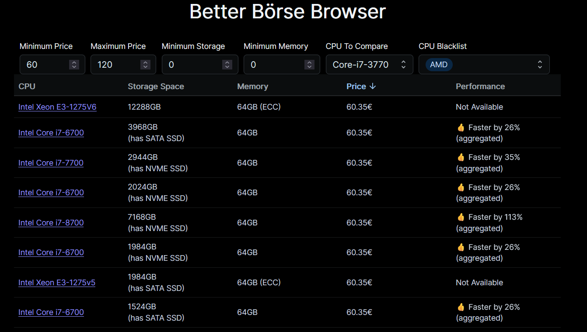

# Better Börsen Browser

### This project is not affiliated with Hetzner at all

Browsing the Hetzner Serverbörse has never been easier!
Uses the https://technical.city for Performance Comparisons
Running this code might conflict with the usage policies of Hetzner of Technical City, so use on your own risk.

## Features
- Filtering that actually makes sense
- Sorting
- Proper Storage Space calculation
- Performance Comparisons against a few common CPUs
- Docker Image: https://hub.docker.com/repository/docker/laberbear/better-boerse-browser



## How to run:

If you just want a CLI/File Output, you can use the CLI script:
```
First install the server dependencies:
cd server && npm ci 
Then run the script:
node cli.js
```

For the web app simply use Docker:
```
docker run -p 3001:3001 laberbear/better-boerse-browser:0.0.4
Go to http://localhost:3001
```