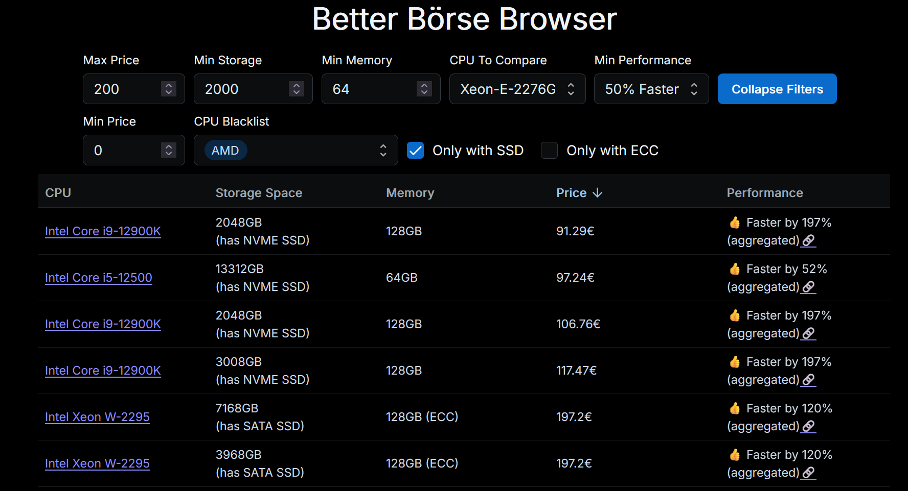

# Better Börsen Browser

### This project is not affiliated with Hetzner at all

Browsing the Hetzner Serverbörse has never been easier!

Uses the https://technical.city for Performance Comparisons

Running this code might conflict with the usage policies of Hetzner or Technical City, so use on your own risk.

## Features

- Filtering by
  - Price
  - Storage
  - Memory
  - Performance
  - SSD
  - ECC
- Sorting
- Proper Storage Space calculation
- Performance Comparisons against a few common CPUs
- Storing historical Serverbörsen Data in an SQLite Database
- Docker Image: https://hub.docker.com/repository/docker/laberbear/better-boerse-browser



## How to run

If you just want a CLI/File Output, you can use the CLI script:

```
First install the server dependencies:
cd server && pnpm install
Then run the script:
node cli.js
```

For the web app simply use Docker:

```
docker run -d \
    -p 3001:3001 \
    --restart unless-stopped \
    -v DATA_FOLDER_ON_HOST:/opt/data
    laberbear/better-boerse-browser:0.1.3
Go to http://localhost:3001
```

## How to develop

First install dependencies (requires nvm to be installed before)

```
nvm install 20
nvm use 20
npm install -g turbo
corepack enable
pnpm install
```

Then run the development environment with

```
pnpm dev
```
